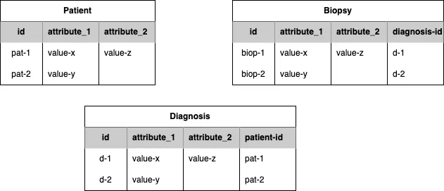
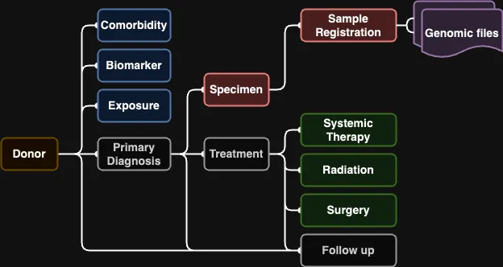

We also call this ‘ ETL ’ or Extract, Transform Load. Basically we need to extract the data from its native database, transform it into the CanDIG data model, and load it into the CanDIG platform.

This step relies on CanDIG’s clinical ETL mapping tool. If you haven’t done so already, clone the repo [clinical_ETL_code: stable](https://github.com/CanDIG/clinical_ETL_code) and note where you have it, we will be using it later!

## A. Data export

The first step is to get your hands on the clinical data. Consult with the data custodians at your site to get an export of the clinical data that needs to be uploaded to CanDIG. It can take some back and forth to get a complete set of data and it can come from multiple sources that may need to be connected later.

:::caution
It is likely this data contains sensitive information, so be sure to store and process it in a secure location.
:::

CanDIG expects data to be in one or more tables, where there are shared identifiers in tables to enable linking between the tables. We expect each column would be a field or attribute of say, a patient or a sample, and each row would be an instance of an object.

A toy partial example of data that could be transformed into the CanDIG model:

*Figure 1: Example of clinical data tables to convert to the CanDIG MoHCCN model*

The `patient-id` in the Diagnosis table, enables a relationship to show which diagnosis belongs to which patient. The `diagnosis-id` in the Biopsy table shows which Biopsy derives from which Diagnosis. Linking them all together (Patient -> Diagnosis -> Biopsy) means a Biopsy can ultimately be linked to the Patient it was taken from. The CanDIG model uses these concepts of linking objects and although the objects and fields may be named differently, as long as the data follows a similar structure we have tools to help convert between your data and the CanDIG model. Next we describe the CanDIG MoH data model.

## B. Model mapping

The CanDIG MoH Clinical data model is based on the MOHCCN v.3.1 data model. To load data into CanDIG, you will need to create a map from your data to the schemas, fields and permissible values in the CanDIG MoH model.

The overall linking structure of the CanDIG data model is shown below:

*Figure 2: object linking and field overview of the CanDIG MoHCCN data model*

Some notes about the model:

* Most objects have only one object that they are directly linked to

* The Follow up object is ideally linked to either a Treatment or Primary Diagnosis, but can be linked directly to the Donor if this information is not available

* Genomic Files are not explicitly in the Clinical data model, but are shown as linking to the Sample Registration because ultimately we will link them to samples when we ingest the genomic data later on

### i. Field and value mapping

1. For every field in your data model, find the relevant field in the CanDIG data model

2. Determine whether the fields contain permissible values

 a. If fields don’t contain permissible values based on the MoHCCN data model, you will need to pre-process data to map your values to valid values. Permissible values for each field can be found in the MoHCCN data model spreadsheet. These values may be from external vocabularies

### ii. Mapping template configuration

In order to use CanDIG’s data transformation functionality, a mapping template that matches the fields in your model to the fields in the CanDIG data model needs to be configured. The complete mapping template is [`moh_v3_template.csv`](https://github.com/CanDIG/clinical_ETL_code/blob/stable/moh_v3_template.csv) and can be found in the [Clinical ETL Code repository](https://github.com/CanDIG/clinical_ETL_code/tree/stable) that you cloned earlier. The README in the repo provides documentation of how to configure and use the code.

In a nutshell, for every field you want to map in the CanDIG MoHCCN data model, you will need to specify where in your exported data files the information for that field exists, and the mapping function that will transform it into a permissible value for that field. The exercise in step B.i will help guide this process.

Template configuration tips:

- Every input sheet/csv must have the ‘identifier’ field specified in the manifest.yml 

- For any fields that you don’t intend on mapping you can comment (#) those rows in the template csv and the conversion script will ignore them

- Linking between objects is done with index fields, they are required for every object being submitted, these fields would be the green or parent linking IDs shown in Figure 2 above.

- If the data in your field is already compatible with the CanDIG data model, use the single_val() method, this essentially returns the same value found in the input sheet

- If the field you are mapping can have multiple values, i.e. an array field: 

  - the information needs to be returned as an array, even if only one value is specified

  - If the text has multiple values split by a delimiter, a function needs to be used to convert it to an array. The pipe_delim() mapping method expects values to be delimited with a single pipe and no surrounding white space, i.e. '|' . If your data is separated by a different delimiter, you will need to write a new mapping method that splits your data accurately

- Numeric fields can be of type integer or float, ensure you use the correct mapping method for the value type that is expected by the model

- Date Intervals were incorporated into version 2.1 of the MoH model. clinical_ETL_code v2.0.0 expects dates in YYYY-MM or YYYY-MM-DD format and will automatically calculate the date interval relative to the earliest PrimaryDiagnosis.date_of_diagnosis. The Donor.date_resolution must also be specified to configure whether both day and month, or only month intervals are calculated.

- If your input data already has date intervals specified as integers, the int_to_date_interval_json() mapping method can be used to convert the integer into the expected json format. The Donor.date_resolution field will be used to determine the resolution the integers represent.

 Once the mapping template CSV is configured, you can continue with clinical data conversion.

### iii. Clinical Data conversion and Validation

The instructions in the [clinical ETL Code README](https://github.com/CanDIG/clinical_ETL_code/blob/develop/README.md) go over the steps required to successfully run the `CSVConvert.py` script which will convert input tabular format sheets into the JSON file required to ingest into CanDIG.

This will likely be an iterative process of attempting conversion and fixing any errors that are causing validation errors.

Clinical Data conversion tips:

- Warnings won’t cause ingest to fail but might be things you would like to fix in your data and a donor with any 'warnings' will not be considered 'complete'

- Although the MoHCCN data model has many required and conditionally required fields, missing values in these field will not cause ingest to fail

- Any fields that do not meet the permissible values requirements will cause ingest to fail, if these are challenging to meet, they can be left blank and added at a later date. If there is no expectation that the field will ever be completed, the 'Not available' option can be used

:::tip
Once you get to a final version of csv files, manifest, mapping functions, and mapping template, we recommend saving these files in a secure location as they will make it easier to update and reingest data if needed.
:::
